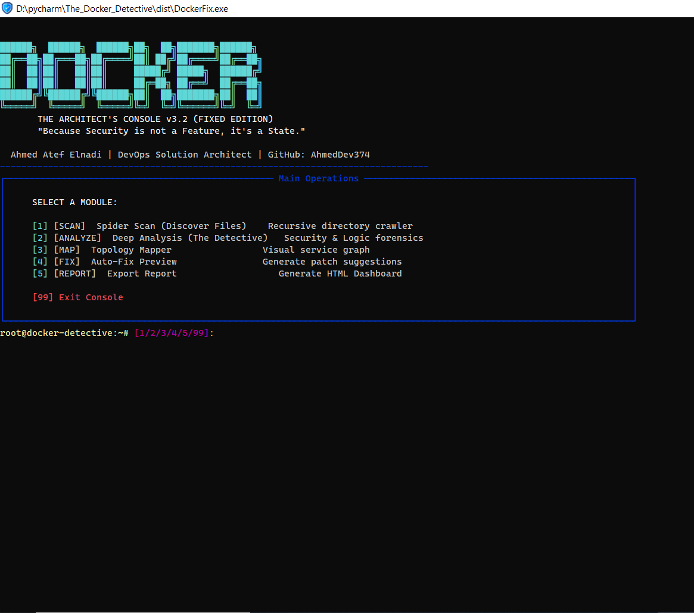
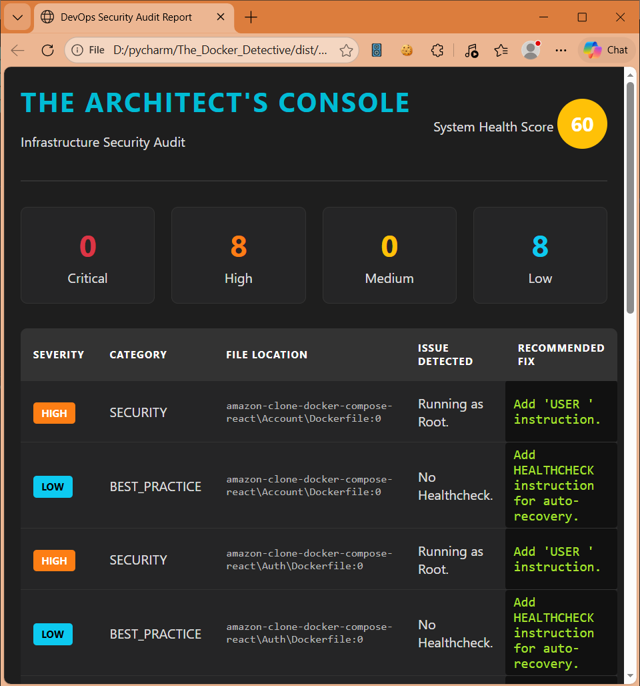

Here is the **Ultimate "Hacker/Professional" README**.

I have redesigned it so the **Images (Visual Intelligence)** are at the **VERY TOP**. This is the best way to catch people's attention immediately.

### 📋 Instructions to make images work:

1. Go to your `Images` folder on your computer.
2. Take a screenshot of the black CLI tool and name it: **`cli_preview.png`**
3. Take a screenshot of the HTML Report and name it: **`report_preview.png`**
4. Put both files inside the `Images` folder in your project.
5. **Copy the code below** and paste it into `README.md`.

---

```markdown
<div align="center">

```text
██████╗  ██████╗  ██████╗██╗  ██╗███████╗██████╗ 
██╔══██╗██╔═══██╗██╔════╝██║ ██╔╝██╔════╝██╔══██╗
██║  ██║██║   ██║██║     █████╔╝ █████╗  ██████╔╝
██║  ██║██║   ██║██║     ██╔═██╗ ██╔══╝  ██╔══██╗
██████╔╝╚██████╔╝╚██████╗██║  ██╗███████╗██║  ██║
╚═════╝  ╚═════╝  ╚═════╝╚═╝  ╚═╝╚══════╝╚═╝  ╚═╝

```

# 🛡️ THE ARCHITECT'S CONSOLE v3.2

### Advanced Dockerfile Health & Security Scanner

**"Security is not a Feature. It is a State."**

[⬇️ Download Portable .EXE](https://www.google.com/search?q=https://github.com/AhmedDev374/Dockerfile-Health-Scanner/tree/main/Download%2520EXE) • [🐛 Report Bug](https://www.google.com/search?q=https://github.com/AhmedDev374/Dockerfile-Health-Scanner/issues)

---

### 📸 VISUAL INTELLIGENCE

*See the tool in action before you run it.*

<p float="left" align="center">


</p>
<p align="center"><i><b>Left:</b> The Command Line Interceptor • <b>Right:</b> The Forensic HTML Audit</i></p>

</div>

---

## 🚀 Mission Briefing

In the era of Microservices, a single misconfigured `Dockerfile` can be the gateway to a critical breach. **The Architect's Console** is not just a linter; it is a **forensic engine** designed to traverse your infrastructure, map your topology, and expose hidden vulnerabilities before they reach production.

Most tools just check syntax. **This tool checks intent.**

---

## ⚡ Key Capabilities

| Module | Icon | Function |
| --- | --- | --- |
| **Spider Scan** | 🕷️ | Recursively crawls your entire drive/project to locate every hidden Docker asset. |
| **Deep Forensics** | 🔬 | Heuristic engine that detects **Root Privileges**, **Exposed SSH**, **Leaked Secrets**, and **Cache Inefficiencies**. |
| **Topology Mapper** | 🗺️ | Visualizes the relationship between your `docker-compose` services in a tree structure. |
| **Auto-Fixer** | 🔧 | Doesn't just find the bug—it generates the code to fix it. |
| **Executive Report** | 📊 | Generates a boardroom-ready **HTML Dashboard** with a calculated "System Health Score." |

---

## 📥 Quick Start (No Python Needed)

We believe in **portability**. You don't need to install Python or dependencies to audit your system.

1. Navigate to the **[`Download EXE`](https://www.google.com/search?q=https://github.com/AhmedDev374/Dockerfile-Health-Scanner/tree/main/Download%2520EXE)** folder in this repo.
2. Download `DockerFix.exe`.
3. **Run it.** That's it.

*The tool includes a **Smart Icon Detection System** that automatically adapts to your terminal (Modern Emojis vs. Legacy Windows Command Prompt).*

---

## 🛠️ Developer Installation (Source Code)

If you prefer to run from source or contribute to the architecture:

```bash
# 1. Clone the repository
git clone [https://github.com/AhmedDev374/Dockerfile-Health-Scanner.git](https://github.com/AhmedDev374/Dockerfile-Health-Scanner.git)

# 2. Enter the directory
cd Dockerfile-Health-Scanner

# 3. Install dependencies (The Rich & Typer Engine)
pip install -r requirements.txt

# 4. Launch the Console
python main.py

```

---

## 🧠 The Heuristic Engine (What it hunts)

The scanner looks for specific patterns that compromise security or performance:

* 🔴 **CRITICAL:** `sudo` usage, Exposed Port 22 (SSH), Hardcoded Secrets (AWS Keys, Passwords), Privileged Mode in Compose.
* 🟠 **HIGH:** Running containers as `Root` (missing USER instruction), `:latest` tag usage.
* 🟡 **MEDIUM:** Inefficient Caching (`apk` / `apt` cache not cleared), Missing Healthchecks.
* 🔵 **LOW:** Best practice suggestions.

---

## 🤝 Contributing

This project is open-source. We are looking for Architects and Security Engineers to expand the heuristic database.

1. Fork the Project
2. Create your Feature Branch (`git checkout -b feature/AmazingFeature`)
3. Commit your Changes (`git commit -m 'Add some AmazingFeature'`)
4. Push to the Branch (`git push origin feature/AmazingFeature`)
5. Open a Pull Request

---

<div align="center">

**Developed with 💻 & ☕ by [Ahmed Atef Elnadi**](https://www.google.com/search?q=https://github.com/AhmedDev374)

*DevOps Solution Architect*

</div>

```

```
